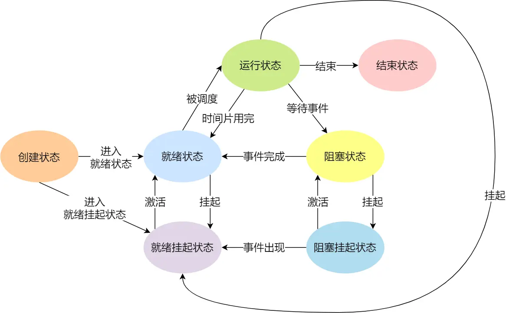

-[进程](进程)
## 进程
+ 代码只是存储在硬件的静态文件，编译后形成了二进制可执行文件，运行这些文件时，" 会被装载在内存，cpu从内存取指令执行 ",进程概念
+ 并行和并发：并行是多个进程同时执行，并发是多个进程在一段时间内交替执行
+ 进程状态：

+ 阻塞和挂起的区别：阻塞占用物理内存，挂起不占用物理内存，将其交换到硬盘
+ 进程挂起的原因：内存不足，sleep(),用于希望挂起(eg:ctrl+z)
+ 进程控制快(pcb)结构描述进程，通长用链表存储相同状态的进程放一条
+ 上下文切换：进程上下文切换，线程上下文切换，中断上下文切换
+ 进程=程序+数据+进程控制块(PCB)